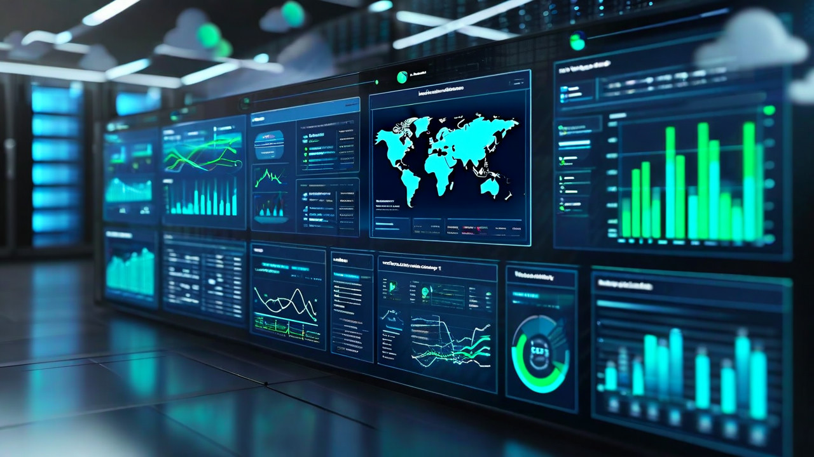
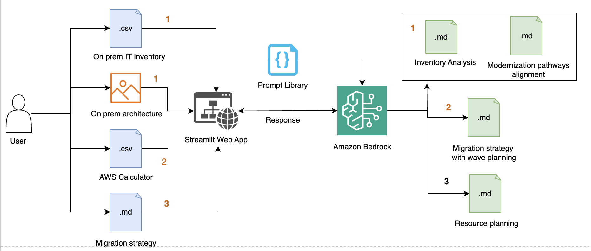

# Generative AI: Art of Possibility for AWS MAP Assessment

A comprehensive Streamlit-based demonstration showcasing how Generative AI can transform the AWS Migration Acceleration Program (MAP) assessment phase. This solution leverages Amazon Bedrock Claude models to automate and enhance migration planning, cost optimization, modernization opportunity identification, and resource planning.



## Overview

This demo illustrates the application of Generative AI during the MAP assessment phase, following the completion of on-premises discovery. It showcases capabilities that enhance migration planning, cost optimization, identification of modernization opportunities, and resource planning—processes which were previously both time-consuming and complex.

### Key Benefits

- **Accelerated Analysis**: Automated infrastructure data analysis to generate strategic recommendations
- **Predictive Planning**: MAP funding milestone predictions and comprehensive migration wave plans
- **Cost Optimization**: Data-driven cost projections and modernization pathway analysis
- **Resource Intelligence**: Automated team structure and resource allocation planning

## Features

### 1. Modernization Opportunity Analysis
- Analyzes architecture and on-premises infrastructure data
- Identifies modernization pathways with corresponding AWS cost projections
- Supports CSV inventory data and architecture image analysis
- Provides detailed AWS service recommendations

### 2. Migration Strategy Development
- Creates data-driven migration patterns and wave planning
- Generates cumulative spend forecasts and $50k milestone predictions
- Processes AWS Calculator CSV exports
- Accelerates migration timeline development

### 3. Resource Planning
- Develops detailed team structures and resource allocation plans
- Provides five key outputs:
  - Executive summary
  - Team structure evaluation
  - Resource summary
  - Wave-based planning
  - Role-based resource allocation
- Supports Hub-and-Spoke and Wave-Based team models

## High level process



## Technology Stack

- **Frontend**: Streamlit for interactive web interface
- **AI/ML**: Amazon Bedrock with Claude 3.7 Sonnet models
- **Data and Image Processing**: Pandas, PyMuPDF for document processing

## Prerequisites

### AWS Requirements
- An [AWS account](https://aws.amazon.com/)
- Amazon Bedrock access with Claude model permissions in AWS regions US East (N. Virginia) *us-east-1* for this code.
- [AWS Command Line Interface (AWS CLI)](https://aws.amazon.com/cli/)
- Python (version 3.8 or later)
- [AWS CLI configured](https://docs.aws.amazon.com/cli/v1/userguide/cli-chap-configure.html) to interact with AWS services using commands in command-line shell

## Quick Start

### 1. Clone the Repository
``` Python3
git clone <repository-url>
cd map-genai-usecases-aws-sample
```

### 2. Install Dependencies
``` Python3
pip install -r requirements.txt
```

### 3. Configure AWS Credentials
``` bash
# Option 1: AWS CLI
aws configure

# Option 2: Environment Variables
export AWS_ACCESS_KEY_ID=your_access_key
export AWS_SECRET_ACCESS_KEY=your_secret_key
export AWS_DEFAULT_REGION=us-east-1
```

### 4. Enable Bedrock Models
Ensure you have access to the following models in Amazon Bedrock:
- `anthropic.claude-3-5-sonnet-20240620-v1:0`
- `us.anthropic.claude-3-7-sonnet-20250219-v1:0`

### 5. Run the Application
``` Python3
streamlit run home_page.py
```

The application will be available at `http://localhost:8501`

## Usage Guide

### Modernization Opportunity Analysis
1. Navigate to the "Modernization Opportunity" page
2. Upload your IT inventory CSV file
3. Define the scope of modernization
4. Optionally upload an on-premises architecture image
5. Review modernization recommendations

### Migration Strategy Development
1. Go to the "Migration Strategy" page
2. Upload AWS Calculator CSV export
3. Define migration parameters and constraints
4. Generate comprehensive migration wave planning
5. Review cost projections and milestone predictions
6. (optionally) Download the migration strategy document which is useful for the use case 'Resource Planning'

### Resource Planning
1. Access the "Resource Planning" page
2. Upload migration strategy document with wave planning generated using "Migration Strategy" page 
3. Review resource profile data (see /sampledata/resource_profile.csv)
4. Generate detailed team structure recommendations
5. Analyze resource allocation and planning outputs


## Important Notes

> 💡 **AI Accuracy Disclaimer**: While our GenAI provides valuable insights, it might occasionally generate inaccurate predictions. Always validate and double-check AI-generated recommendations before implementation.

> 💡 **This solution is explicitly designed for proof-of-concept purposes** only to explore the art of possibility with Generative AI for MAP assessments. Please adhere to your company's enhanced security and compliance policies


### Best Practices
- Validate all Generative AI-generated recommendations with domain experts
- Test with your specific data like IT inventory data (e.g., server lists, application catalogs), On-premises architecture diagrams,AWS Calculator and Resource profile data
- Monitor AWS costs
- Optionally, use the following guidance to containerise the Streamlit App using Amazon Elastic Kubernetes Service (Amazon EKS)
  - Build the Docker image and push this Docker image to Amazon Elastic Container Registry (Amazon ECR)
  - Define Kubernetes deployment and service manifests
  - Set up Amazon Elastic Kubernetes Service (EKS) cluster and Fargate profile
  - Configure Amazon CloudFront and Application Load Balancer
  - Set up an AWS CodePipeline with AWS CodeBuild (i.e build the Docker image, push it to ECR, and apply the Kubernetes manifests.) to automate the deployment process
  - **Set up Amazon Virtual Private Cloud (Amazon VPC) with enhanced security features and configure subnets, route tables, and security groups. Implement IAM roles using principle of the least privillage, encryption, network policies, and VPC flow logs to enhance security. Use CloudWatch for comprehensive logging, metrics, alarms, and dashboards to ensure your application runs smoothly and efficiently.**


## Cost 

- [Amazon CloudWatch](https://docs.aws.amazon.com/bedrock/latest/userguide/monitoring.html) to monitor runtime metrics for Bedrock applications, providing additional insights into performance and cost management
- Implement caching for repeated analyses
- Amazon Bedrock [supports foundation models (FMs)](https://docs.aws.amazon.com/bedrock/latest/userguide/models-supported.html) from providers like Anthropic, Amazon, AI21 Labs, Cohere, DeepSeek,Luma AI, Meta, Mistral AI, OpenAI, Stability AI and others. Use appropriate model sizes for different use cases
- Consider compute reserved capacity for high-volume usage

## Contributing

1. Fork the repository
2. Create a feature branch (`git checkout -b feature/amazing-feature`)
3. Commit your changes (`git commit -m 'Add amazing feature'`)
4. Push to the branch (`git push origin feature/amazing-feature`)
5. Open a Pull Request

## License

This project is licensed under the MIT License - see the LICENSE file for details.

## Support

For support and questions:
- Create an issue in the GitHub repository
- Review the AWS Bedrock documentation
- Check Streamlit documentation for UI-related issues
