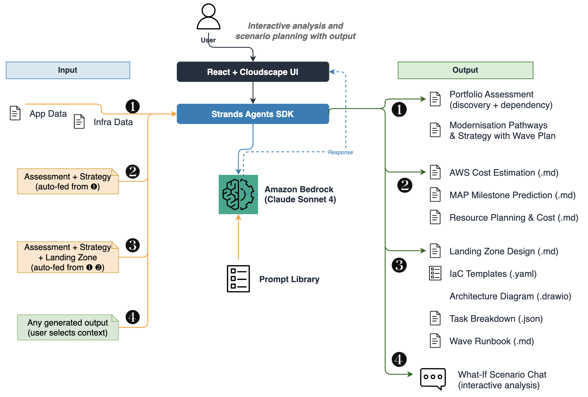

# MAP Agentic Accelerator

## Overview

An AI-powered AWS cloud migration assessment and execution planning platform built with [Strands Agents SDK](https://github.com/strands-agents/sdk-python). It uses multi-agent orchestration patterns — parallel graphs, sequential graphs, and standalone agents — to guide users through the full migration lifecycle, from portfolio discovery through dependency analysis, strategy recommendation, AWS cost estimation, landing zone design, task breakdown, resource planning, and project management integration.

All agents use Claude Sonnet 4 via Amazon Bedrock with real-time streaming through Server-Sent Events (SSE).

## Features

### 1. Portfolio Discovery & Dependency Analysis

- Parallel AI analysis of application and infrastructure CSV inventories
- Application classification (Legacy, Home Grown, SaaS, Third Party) with EOL risk identification
- Deterministic dependency graph construction with cluster detection, circular dependency identification, and migration complexity scoring
- AI-enriched executive summary with migration rationale

### 2. Migration & Modernisation Strategy

- Evaluates five wave planning strategies (WP1–WP5) with velocity pattern recommendation
- R-type classification (Rehost, Replatform, Refactor, Retire, Retain, Repurchase)
- Gantt chart visualisation for wave timelines

### 3. AWS Cost Estimation & MAP Milestone Prediction

- Modernisation pathway analysis with AWS service recommendations
- Monthly and annual run-rate cost projections
- Cumulative spend forecasting with $50K MAP milestone prediction
- Acceleration recommendations for milestone achievement

### 4. Landing Zone Design

- Multi-agent graph producing architecture design, IaC templates (CloudFormation), and Draw.io diagrams
- Region, account strategy, and connectivity configuration inputs

### 5. Task Breakdown & Integration with Project Management Platform (Taiga Integration)

- Structured hierarchy: Waves → Epics → Stories → Tasks with Gantt chart
- Integrates with [Taiga](https://taiga.io/), an open-source agile project management platform, to push the generated task breakdown directly into a Taiga project
- Taiga agent authenticates via REST API, creates epics, user stories, and tasks, and links stories to epics automatically
- Enables Kanban board sync so migration teams can track execution progress directly in Taiga without manual data entry

### 6. Wave Runbook Generation

- Pre-migration checklist, cutover steps, rollback plan, and communication templates

### 7. Resource Planning

- Team structure evaluation (Hub-and-Spoke vs Wave-Based models)
- Wave-based resource allocation with role-based costing
- Customisable resource profile template

### 8. What-If Scenario Chat

- Context-aware multi-turn conversation across any combination of generated outputs
- Selective context chip toggles — choose which outputs to include as chat context
- Mermaid diagram and table rendering in responses

### 9. Reports & Artifacts Download

- Centralised download page for all generated outputs (JSON, Markdown, YAML, Draw.io XML)
- Session-based status tracking with one-click download

### 10. Architecture Diagram Generation

- Describe any AWS architecture in natural language and generate a professional Draw.io XML diagram
- AI produces properly styled diagrams with AWS service icons, connections, and layout
- Download the generated `.drawio` file or open it directly in draw.io for editing

### 11. Prompt Library

Per-agent system prompts stored in `prompt_library/` — review and tailor these templates to your specific migration methodology before use.

| Domain | Prompt File | Purpose |
| ------ | ----------- | ------- |
| Discovery | `discovery/discovery_prompt.py` | Application, infrastructure, and summary analysis prompts |
| Strategy | `strategy/strategy_prompt.py` | Wave planning and R-type classification |
| AWS Cost | `aws_cost/aws_cost_prompt.py` | Modernisation pathway cost estimation |
| MAP Milestone | `partner_50k_milestone/partner_50k_milestone.py` | $50K milestone prediction and acceleration |
| Landing Zone | `landing_zone/landing_zone_prompt.py` | Landing zone architecture design |
| Architecture Diagram | `architecture_diagram/architecture_diagram_prompt.py` | Draw.io XML diagram generation |
| Landing Zone Diagram | `architecture_diagram/landing_zone_diagram_prompt.py` | Landing zone diagram generation |
| Task Breakdown | `task_breakdown/task_breakdown_prompt.py` | Wave-based task hierarchy |
| Wave Runbook | `wave_runbook/wave_runbook_prompt.py` | Runbook generation (cutover, rollback) |
| Resource Planning | `resource_planning/resource_planning_prompt.py` | Team structure and resource allocation |
| Taiga | `taiga/taiga_prompt.py` | Project management integration |
| Chat | `chat/chat_prompt.py` | What-if scenario conversation |

> 💡 **Prompt Customisation:** Review each prompt file to understand default assumptions and tailor them to your organisational requirements.

## High-Level Process

```text
Upload CSVs → Discovery → Strategy → Cost → Landing Zone → Tasks → Runbook → Chat
```



> 📐 **Architecture Diagram:** A Draw.io version of this process flow is available at [`architecture.drawio`](backend/sample_data/architecture.drawio) — open in [draw.io](https://app.diagrams.net/) for editing.

| Stage | Components |
| ----- | ---------- |
| **Input** | Application inventory CSV, Infrastructure inventory CSV |
| **Processing** | Strands Agents SDK (multi-agent graphs + standalone agents), Claude Sonnet 4 via Amazon Bedrock, Prompt Library templates |
| **Output Deliverables** | Portfolio Assessment (JSON), Migration Strategy (MD), AWS Cost Estimation (MD), MAP Milestone Prediction (MD), Landing Zone Design (MD), IaC Templates (YAML), Architecture Diagram (.drawio), Task Breakdown (JSON), Wave Runbook (MD), Resource Plan (MD) |
| **Interactive Chat** | What-if scenario exploration across any combination of generated outputs |

## Technology Stack

| Layer | Technology |
| ----- | ---------- |
| **Frontend** | React 18, TypeScript, Cloudscape Design System (AWS UI), Mermaid.js |
| **Backend** | Python, FastAPI, Uvicorn |
| **Gen AI** | Strands Agents SDK, Claude Sonnet 4 (Amazon Bedrock) |
| **Communication** | Server-Sent Events (SSE) for real-time agent streaming |
| **External Services** | Taiga (project management), Draw.io (diagram rendering) |

## Folder Structure

```text
├── backend/
│   ├── app.py                  # FastAPI API endpoints
│   ├── *_agent.py              # One agent file per capability (12 agents)
│   ├── requirements.txt        # Python dependencies
│   ├── sample_data/            # Sample CSV files, high-level process PNG, architecture.drawio
│   └── utils/                  # Config, Taiga credentials, resource profile template
├── prompt_library/             # Per-agent system prompts (12 domains — see Features §11)
├── frontend/                   # React + Cloudscape UI
└── documents/
```

## Utils Folder

| File | Purpose |
| ---- | ------- |
| `config.py` | Central configuration — AWS region (default `us-east-1`), model IDs (Claude Sonnet 4 default, 3.7 and 3.5 available), max tokens (65,536), temperature (0.7), CORS origins |
| `taiga_config.json` | Taiga API URL, credentials, and project slug for project management integration |
| `resource_profile_template.csv` | Resource roles, experience levels, and daily rates used by the Resource Planning agent |

## Prerequisites

- **AWS Account** with Amazon Bedrock access in `us-east-1`
- **Claude Sonnet 4** model enabled in Amazon Bedrock (`us.anthropic.claude-sonnet-4-20250514-v1:0`)
- **Python** 3.8 or later
- **Node.js** 18 or later (with npm)
- **AWS CLI** configured with valid credentials
- **Taiga Account** (optional — required only for Task Breakdown → Taiga push feature)
  - Sign up for a free account at [tree.taiga.io](https://tree.taiga.io/) or self-host using [Taiga Docker setup](https://docs.taiga.io/)
  - Create a project with **Kanban** template enabled
  - Enable **Epics** and **Backlog** modules in Project → Settings → Modules
  - Note your project slug (visible in the project URL: `tree.taiga.io/project/<your-project-slug>`)

## Quick Start

### 1. Clone the Repository

```bash
git clone <repository-url>
cd migration-assessment-tool
```

### 2. Install Backend Dependencies

```bash
pip install -r backend/requirements.txt
```

### 3. Install Frontend Dependencies

```bash
cd frontend
npm install
cd ..
```

### 4. Configure AWS Credentials

```bash
# Option 1: AWS CLI
aws configure

# Option 2: Environment variables
export AWS_ACCESS_KEY_ID=your_access_key
export AWS_SECRET_ACCESS_KEY=your_secret_key
export AWS_DEFAULT_REGION=us-east-1
```

### 5. Review Configuration

Review `backend/utils/config.py` for model IDs, region, and parameters. Key defaults:

- **Model:** Claude Sonnet 4 (`us.anthropic.claude-sonnet-4-20250514-v1:0`)
- **Region:** `us-east-1` (override via `AWS_REGION` environment variable)
- **Max Tokens:** 65,536

### 6. Configure Taiga (Optional)

If you plan to use the "Push to Taiga" feature, update `backend/utils/taiga_config.json` with your Taiga credentials:

```json
{
  "taiga": {
    "base_url": "https://api.taiga.io/api/v1",
    "username": "<your-taiga-username>",
    "password": "<your-taiga-password>",
    "project_slug": "<your-project-slug>"
  },
  "settings": {
    "timeout": 30,
    "verify_ssl": true,
    "retry_attempts": 3
  }
}
```

**Taiga project setup checklist:**

1. Create a new project at [tree.taiga.io](https://tree.taiga.io/) using the **Kanban** template
2. Go to **Settings → Modules** and enable **Epics** and **Backlog**
3. Copy your project slug from the URL (e.g., `my-org-aws-migration`)
4. Update the config file with your username, password, and project slug

> ⚠️ **Security:** For production use, migrate Taiga credentials to AWS Secrets Manager or environment variables. Do not commit credentials to version control.

For more details, refer to the [Taiga API documentation](https://docs.taiga.io/api.html).

### 7. Run the Backend

```bash
cd backend
uvicorn app:app --host 0.0.0.0 --port 8000
```

### 8. Run the Frontend

```bash
cd frontend
npm run dev
```

The application will be available at `http://localhost:3000`.

## Usage Guide

1. **Upload Inventory** — Navigate to Migration Assessment → Upload tab. Upload application CSV and infrastructure CSV (see `backend/sample_data/` for format).
2. **Review Discovery** — Switch to IT Discovery tab. Review application classifications, infrastructure mapping, and risk signals.
3. **Review Dependencies** — Switch to Application Dependencies tab. Review dependency graph, clusters, circular dependencies, and complexity scores.
4. **Generate Strategy** — Switch to Strategy tab. Enter migration drivers, timeline, and start date. Generate strategy report.
5. **Estimate Costs** — Navigate to Modernisation & Cost. Generate AWS cost estimation and MAP milestone prediction.
6. **Plan Resources** — Navigate to Resource Planning. Generate team structure and role-based allocation.
7. **Design Landing Zone** — Navigate to Execution Planning → Landing Zone tab. Enter region, account strategy, and connectivity. Generate design, IaC templates, and architecture diagram.
8. **Break Down Tasks** — Switch to Task Management tab. Generate wave-based task hierarchy. Optionally push to Taiga.
9. **Generate Runbook** — Switch to Wave Runbooks tab. Generate pre-migration, cutover, and rollback plans.
10. **Explore Scenarios** — Navigate to What-If Scenario. Toggle context chips and ask what-if questions.
11. **Download Artefacts** — Navigate to Reports & Artifacts. Download any generated output.

## Important Notes

> 💡 **AI Accuracy Disclaimer:** Whilst GenAI provides valuable insights, it may occasionally produce non-deterministic outcomes due to its probabilistic nature. Always validate AI-generated recommendations before implementation.
>
> 💡 **Proof of Concept:** This solution is designed for proof-of-concept purposes to explore the art of possibility with Generative AI for MAP assessments. Adhere to your organisation's security and compliance policies.
>
> ⚠️ **Session Storage:** All data is stored in browser `sessionStorage`. Data is lost when the browser tab is closed. No server-side persistence is implemented.
>
> ⚠️ **Taiga Credentials:** Taiga API credentials are stored in `backend/utils/taiga_config.json`. For production use, migrate to AWS Secrets Manager or environment variables.

## Best Practices

- Validate all AI-generated recommendations with domain experts
- Test with your specific IT inventory data (application catalogues, server lists)
- Review and customise prompt templates in `prompt_library/` before use
- Monitor Amazon Bedrock usage and costs
- Use sample data in `backend/sample_data/` to familiarise yourself with expected CSV formats
- Store sensitive credentials (Taiga API credentials, AWS keys) in [AWS Secrets Manager](https://docs.aws.amazon.com/secretsmanager/) or [AWS Systems Manager Parameter Store](https://docs.aws.amazon.com/systems-manager/latest/userguide/systems-manager-parameter-store.html) rather than in configuration files
- Review Amazon Bedrock IAM policies to ensure `bedrock:InvokeModel` permissions are scoped appropriately for your deployment — refer to the [Amazon Bedrock security documentation](https://docs.aws.amazon.com/bedrock/latest/userguide/security-iam.html)
- For SSE-based agent streaming, review Application Load Balancer idle timeout settings to accommodate long-running agent graph executions — the FastAPI + EKS + CloudFront architecture supports this pattern well
- Optionally, use the following guidance to containerise the application using Amazon Elastic Kubernetes Service (Amazon EKS):
  - Build Docker images for the FastAPI backend and the React frontend (static build via `npm run build` served by Nginx or similar)
  - Push Docker images to Amazon Elastic Container Registry (Amazon ECR)
  - Define Kubernetes deployment and service manifests for both backend and frontend containers
  - Set up an Amazon EKS cluster with Fargate profile
  - Configure Amazon CloudFront and Application Load Balancer for frontend distribution and API routing
  - Set up an AWS CodePipeline with AWS CodeBuild to automate the build, push to ECR, and Kubernetes manifest deployment
  - Set up Amazon Virtual Private Cloud (Amazon VPC) with enhanced security features — configure subnets, route tables, and security groups. Implement IAM roles using the principle of least privilege, encryption, network policies, and VPC flow logs. Use Amazon CloudWatch for comprehensive logging, metrics, alarms, and dashboards

## Cost Considerations

- **Amazon Bedrock:** Claude Sonnet 4 usage is billed per input/output token — monitor via Amazon CloudWatch
- **Multi-Agent Graphs:** Discovery, landing zone, and cost agents run multiple LLM calls per request
- **Session-Based:** No external database or vector store costs — all state is in browser session storage
- **Taiga:** Self-hosted or cloud instance costs apply if using project management integration
- Implement caching for repeated analyses to reduce token consumption

## Contributing

1. Fork the repository
2. Create a feature branch (`git checkout -b feature/amazing-feature`)
3. Commit your changes (`git commit -m 'Add amazing feature'`)
4. Push to the branch (`git push origin feature/amazing-feature`)
5. Open a Pull Request

## Licence

This project is licensed under the MIT Licence. See the [LICENCE](LICENCE) file for details.

## Support

- Create an issue in the GitHub repository
- Review [Amazon Bedrock documentation](https://docs.aws.amazon.com/bedrock/)
- Review [Strands Agents SDK documentation](https://github.com/strands-agents/sdk-python)
- Review [Cloudscape Design System documentation](https://cloudscape.design/)
